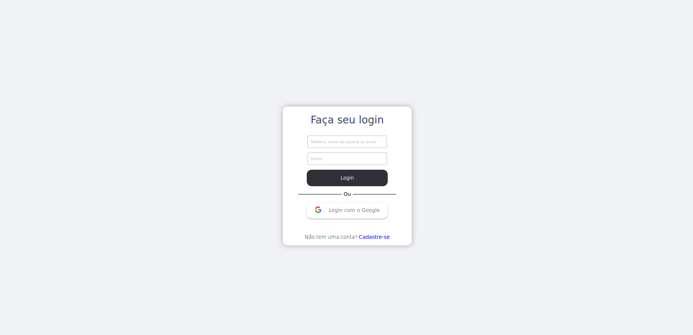

# Kanima Authentication

  

 

## 🚀 Tecnologias

Projeto desenvolvido com as seguintes tecnologias:

<ul>
    <li>ReactJS</li>
    <li>OAuth 2.0</li>
    <li>React Google Login</li>
    <li>Styled Components</li>
    <li>React Lottie</li>
</ul>

## 💻 Projeto

Desenvolvido para estudo de integrações entre ReactJS e Google API.

Espero que aproveite o melhor do meu esforço, trabalho e dedicação.
